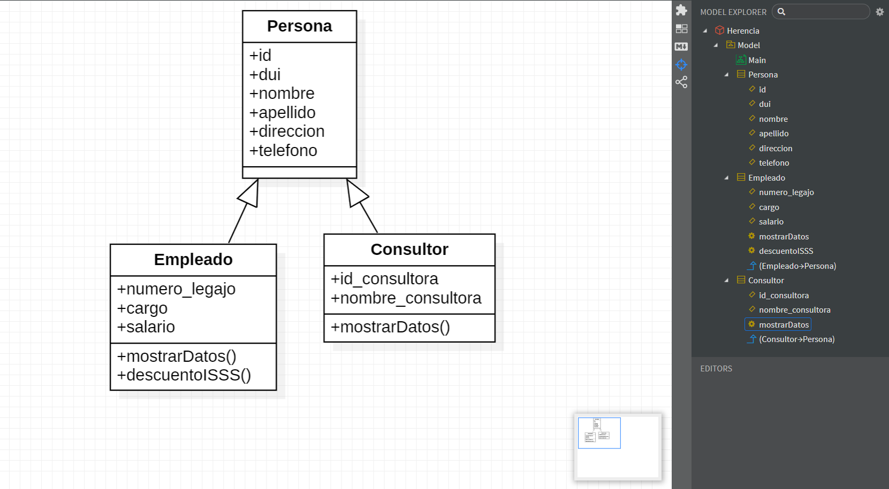

# POO Herencia en Java
Practica Programacion Orientado a Obejtos con Herencia usando JAVA, Ingreso de personas empleados y consultor, mostrar datos y calcular el sueldo con IVA para un empleado
 
 

## Diagrama POO herencia

## Empleado

## Consultor

